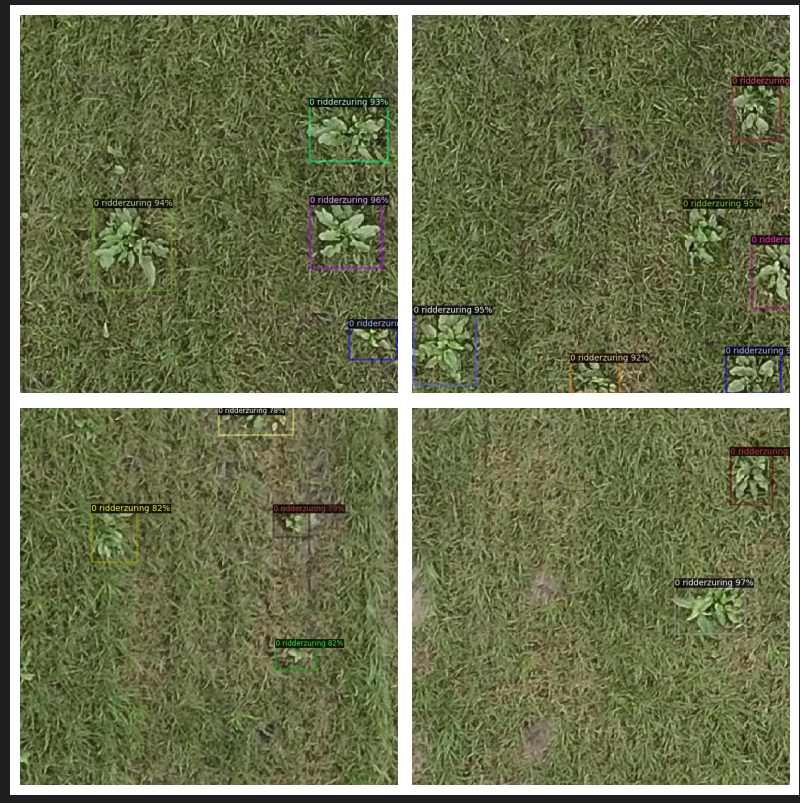

## Grass Weed and Ridderzuring Detection using Computer Vision

    "data_time": 0.0016029000000798987,
    "eta_seconds": 0.0,
    "fast_rcnn/cls_accuracy": 0.9453125,
    "fast_rcnn/false_negative": 0.11195361284567351,
    "fast_rcnn/fg_cls_accuracy": 0.8880463871543265,
    "iteration": 299,
    "loss_box_reg": 0.44914330542087555,
    "loss_cls": 0.1546197161078453,
    "loss_rpn_cls": 0.029897204600274563,
    "loss_rpn_loc": 0.016804738901555538,
    "lr": 0.0002491675,
    "rank_data_time": 0.0016029000000798987,
    "roi_head/num_bg_samples": 100.75,
    "roi_head/num_fg_samples": 27.25,
    "rpn/num_neg_anchors": 245.0,
    "rpn/num_pos_anchors": 11.0,
    "time": 0.47443995000026007,
    "total_loss": 0.6720763673074543
